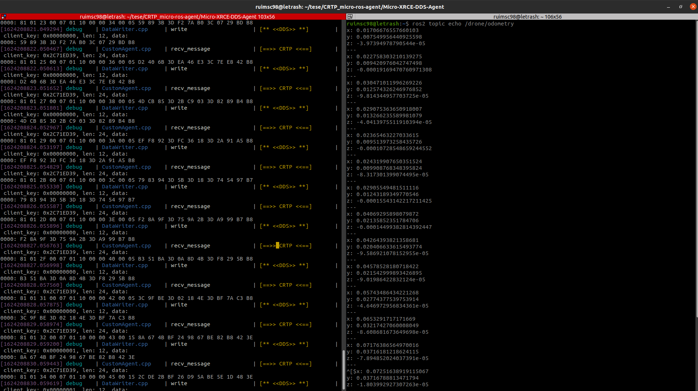

# CRTP_micro-ros-agent (Work in progress!)

Custom transport micro-ROS agent for Bitcraze's Crazyflie 2.0 MAVs

Only works with a CF for now but will work (hopefully!) with multiple in the near future

Under **heavy** development

## Building and installation

This guide assumes that you have a working ROS2 foxy installation, if not please refer to the [official guide](https://docs.ros.org/en/foxy/Installation.html).

Start by cloning this repo and **all its submodules**:

```
git clone --recurse-submodules https://github.com/ruimscarvalho98/CRTP_micro-ros-agent.git
```

Afterwards to install the cpp crazyflie drive first install the libusb dependency:

```
sudo apt install -y libusb-1.0-0-dev
```
then compile the library:
```
cd crazyflie-link-cpp
git submodule init 
git submodule update
mkdir build
cd build
cmake ..
make
```

Next up, compile the custom CRTP micro-xrce-dds agent:

```
cd Micro-XRCE-DDS-Agent
mkdir build && cd build
cmake ..
make
```

And run it from the build folder:

```
cd Micro-XRCE-DDS-Agent/build
./examples/custom_agent/CustomXRCEAgent <uri>
```

Where the uri is specific to your crazyflie, in my case it is "radio://0/80/2M/E7E7E7E7E7" but this can be changed using the cfclient or in the config.h file of the crazyflie firmware. Please note that this only works with radio, to use USB the client-side uROS custom transport in the firmware must be modified.

## Run an example

An example micro-ros application which is based on [this](https://github.com/micro-ROS/freertos_apps) but with a lower publishing frequency and using channel 80 is availble in the test folder. To compile and flash the app to the crazyflie please refer to [this repo](https://github.com/micro-ROS/micro_ros_setup)

Next, start the crazyflie and open two terminals.

In the first one run the custom agent:

```
cd Micro-XRCE-DDS-Agent/build
./examples/custom_agent/CustomXRCEAgent <uri>
```

In the second, echo one of the published topics:

```
ros2 topic echo /drone/odometry
```

You should achieve something like this:


Then move the crazyflie around and watch the values of odometry change in real-time!

